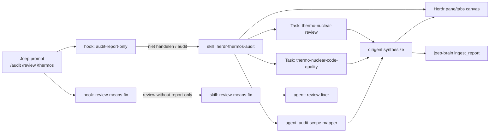

# Connection map — audit / review / thermos / herdr

Use this as the default adjacency when painting the `connections` tab.

## Runtime graph

## Artifact homes

| Kind | Path | Notes |
|------|------|-------|
| Skill | `~/.cursor/skills/herdr-thermos-audit/` | Personal; report-only |
| Hook RO | `~/.cursor/hooks/audit-report-only.sh` | beforeSubmitPrompt |
| Hook fix | `~/.cursor/hooks/review-means-fix.sh` | skipped when RO matches |
| Agents | `~/.cursor/agents/audit-*.md` | canvas + scope mapper |
| Thermos plugin | `~/.cursor/plugins/.../thermos/` | dual thermo subagent types |
| Herdr fork | `~/Documents/herdr` | OnlineChefGroep fork + upstream |
| Herdr ops | `~/Documents/herdr-ops` | fleet hooks/skills install surface |
| Herdr plugins repo | `OnlineChefGroep/herdr-plugins` | plugin registry (MAP.md) |
| Brain | `bc-scan-arm:/var/lib/joep-brain` | laptop thin client |

## Herdr fork ↔ plugin integration

- Product/runtime: `OnlineChefGroep/herdr` checkout at `~/Documents/herdr`
- Ops installers/skills: `~/Documents/herdr-ops` (install.sh → hooks/agents/skills)
- Cursor Thermos plugin is separate from herdr-plugins registry but participates
  in the same audit orchestration when Joep runs `/thermos` inside a Herdr pane
- Fleet controller binary: `~/.local/bin/herdr` / `herdr server`

## Conflict rule

`audit-report-only` **outranks** `review-means-fix` when the prompt matches
`/audit`, `niet handelen`, `report-only`, `geen fix`, or `thermos audit`.
