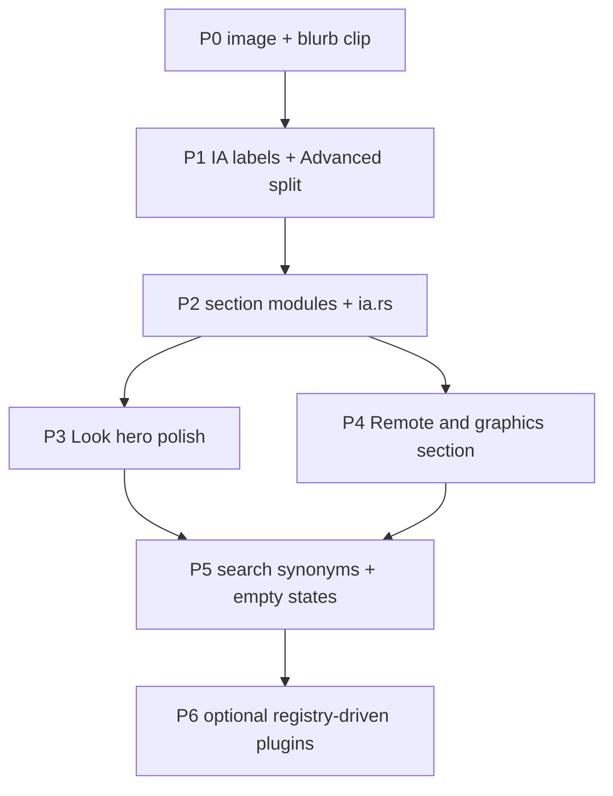

# CHEF Settings UI Design

> Historical wishlist + current shipping target. The 2026-07-14 tabbed modal was
> replaced by the left-nav customization shell on branch
> `cursor/settings-ui-rework-a115`.

## Settings Overlay (Prefix + S)

Accessible via the settings keybinding (default `prefix+s`) — modal overlay with
left navigation, search, and scrollable section content.

### Layout

```
┌─ customize herdr ───────────────────────────────────────────────────┐
│ / search…                                           [Apply] [Close] │
│ ┌ Left nav ┐  ┌ Content ─────────────────────────────────────────┐  │
│ │ appearance │  Section title · short help                        │  │
│ │ layout     │  toggles / choices / live previews                 │  │
│ │ input      │                                                    │  │
│ │ terminal   │                                                    │  │
│ │ notify     │                                                    │  │
│ │ agents ●   │                                                    │  │
│ │ plugins    │                                                    │  │
│ │ updates    │                                                    │  │
│ │ advanced   │                                                    │  │
│ └────────────┘  └────────────────────────────────────────────────┘  │
└─────────────────────────────────────────────────────────────────────┘
```

### Implementation

- Module: `src/ui/settings/` (`catalog`, `layout`, `rows`, `sections`, `spinner`)
- Typed catalog: every row has a `SettingsItemId` (no opaque `usize` payloads)
- Input/actions: `src/app/input/settings.rs` + `src/app/config_io.rs`
- Reads/writes `~/.config/herdr/config.toml` and hot-reloads via
  `apply_config_from_disk`
- Shared `SettingsLayout` drives render and mouse hit-testing
- Animations: `SettingsState.preview_tick` while `Mode::Settings`
- CHEF personalization (Fleet/Plugins kitchen-sink tabs, `com.chefgroep.*`,
  `ENG-` branding) lives in private `GroepOnline/herdr-plugins`, not in
  core settings. Core exposes a native **Plugins** section with installed
  plugin toggles and a curated CHEF catalog install list, plus a generic Advanced
  **fleet ops bar** toggle and a cached, plugin-id-agnostic `fleet_ops.json`
  merge off the render path.

### Sections

| Section | Options |
|---|---|
| Appearance | themes, host auto-switch, spinner hero + categorized picker |
| Layout | pane chrome, sidebar collapse/sort, compact templates (incl. monitoring) |
| Input | mouse/copy/focus redraw, confirms/prompts, host cursor, keybind help CTA |
| Terminal | default shell, shell mode, new cwd, scrollback presets |
| Notifications | sound, toast delivery/delay/position, clipboard toasts |
| Agents | resume-on-restore, integration install/status |
| Plugins | installed on/off + one-step curated installs (friendly names, no CLI dump) |
| Updates | channel, version check, manifest check |
| Advanced | experiments, fleet ops bar, kitty/nested/SSH, clipboard history, config path |

### Plugins v2 (next)

PR-A aligns the curated catalog with `GroepOnline/herdr-plugins` paths on main.
Follow-ups: install progress/toast feedback while `herdr plugin install` runs, load
available entries from `herdr-plugins/registry.json` instead of a hardcoded list, and
a searchable marketplace tab once registry metadata (categories, versions) is wired through
settings actions.

### Non-goals (v1)

- Full public marketplace browser (curated installs; private pack in `herdr-plugins`)
- Full keybind editor (use existing Keybind Help)
- Sidebar token DSL composer
- Workspace TOML templates
- ASCII wireframe template cards (removed — plain apply rows)

---

## Settings rewrite + reorganization plan (2026-08)

Goal: full rewrite of the customize-herdr shell and a cleaner information architecture.
Do **not** land as one megapr; ship phased slices behind the existing left-nav shell until
the new IA is complete.

### Current IA (shipping)

`theme → ui → sound → system → templates → integrations`

Pain (from live TUI + code):

- Appearance packs spinner hero + full theme list; section blurb clipped mid-word
  (`SettingsSection::description` + single-line header in `sections.rs`).
- Advanced is a junk drawer (SSH, Kitty graphics, nested, clipboard history, fleet ops, path).
- Plugins/Agents/Updates compete for “ops” attention; search is global but nav is flat.
- Typed catalog (`SettingsItemId` / `SettingsAction`) is good — keep it; rewrite is layout/IA,
  not a return to opaque `usize` payloads.

### Proposed IA

| Nav | Contents | Notes |
|---|---|---|
| **Look** | theme auto-switch, themes, spinner packs + hero | rename of Appearance; keep live preview |
| **Chrome** | pane borders/gaps, tab bar, sidebar collapse/sort, templates | rename of Layout |
| **Keys & pointer** | mouse, copy-on-select, focus redraw, confirms, host cursor, keybind help CTA | rename of Input |
| **Shell** | default shell, shell mode, cwd, scrollback | rename of Terminal |
| **Alerts** | sound, toast delivery/delay/position, clipboard toasts | rename of Notifications |
| **Agents** | resume-on-restore, integrations | unchanged role |
| **Plugins** | installed + curated catalog | keep install-off-event-loop from #103 |
| **Updates** | channel, version/manifest checks | unchanged |
| **Remote & graphics** | Kitty graphics, nested, manage SSH, clipboard history | **split out of Advanced** |
| **System** | experiments, fleet ops bar, worktrees path, reload/config path | remainder of Advanced |

Search stays global across all sections. Badges stay on Agents (integration updates).

### Architecture (rewrite target)

```text
src/ui/settings/
  catalog.rs      # SettingsItemId + SettingsAction (stable IDs)
  ia.rs           # NEW: section order, labels, descriptions, search synonyms
  layout.rs       # geometry; content header wraps or truncates by display width
  sections/*.rs   # NEW: one renderer module per section (Appearance today is special-cased)
  rows.rs         # row builders keyed by SettingsItemId
  spinner.rs      # hero + packs
src/app/input/settings.rs
src/app/config_io.rs
```

Keep `SettingsLayout` as the single hit-test/render contract. Move Appearance special-casing
(`spinner_hero_rect` / category tabs) behind a `SectionChrome` trait or enum so Look/Chrome/…
can opt into hero bands without growing `sections.rs`.

### Phased DAG



| Phase | Scope | Exit |
|---|---|---|
| **P0** (this PR) | Port Kitty host-repaint fix; truncate section blurbs; shorten descriptions | CI green; images survive focus/repaint |
| **P1** | Rename nav labels (Look/Chrome/…); split Advanced → Remote & graphics + System; no row moves yet beyond grouping | Screenshot IA matches table |
| **P2** | Extract `ia.rs` + `sections/*.rs`; delete god-file growth in `sections.rs` | File size under house limit; same IDs |
| **P3** | Look: spinner/theme preview layout polish (no kitchen metaphors; warm Dutch copy) | Evaluator gate if Signaal tokens apply |
| **P4** | Wire Kitty/SSH/nested into Remote & graphics; docs for Moshi attach | Moshi doc link from blurb |
| **P5** | Search synonyms (`kitty`→Remote, `moshi`→mobile threshold in Chrome/System) | Search hits sensible |
| **P6** | Plugins registry.json (already noted under Plugins v2) | Catalog not hardcoded |

### Non-goals for the rewrite

- Replacing ratatui or the modal overlay model
- Full keybind editor
- Hermes / UDO coupling
- Implementing mosh inside Herdr (see `CHEF-GHOSTTY-OPTS-VS-MOSH.md`; mosh is optional transport only)
